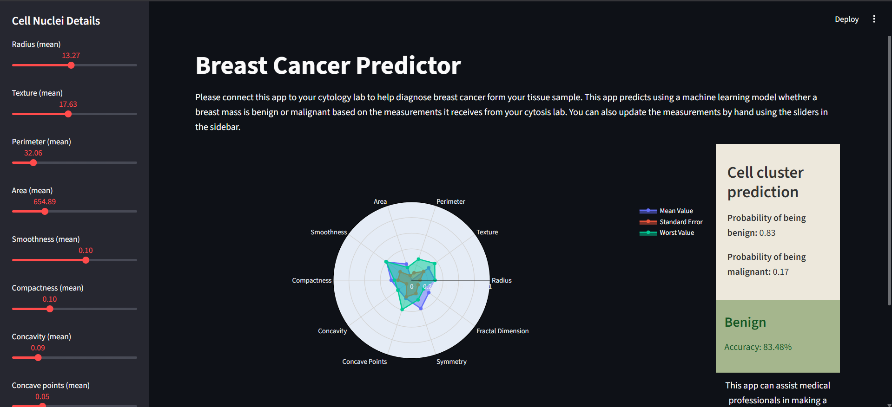
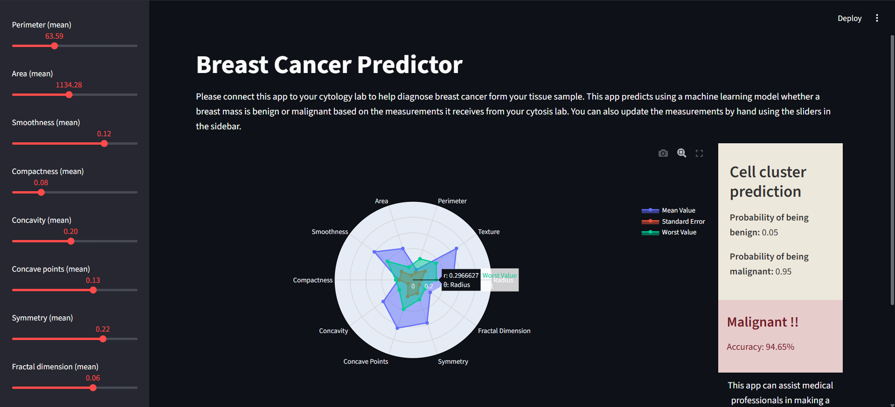

# 🩺 Breast Cancer Predictor  

A machine learning web application built with **Logistic Regression**, **Streamlit**, and **Plotly** that predicts whether a breast tumor is **Benign** or **Malignant** based on cytology lab measurements of cell nuclei.  

---

## 📌 Features  
- Trains a Logistic Regression model on the Breast Cancer dataset.  
- Interactive **Streamlit UI** with sliders to adjust cell nuclei parameters.  
- **Radar chart visualization** for Mean, Standard Error, and Worst values.  
- Probability-based predictions with styled results.  
- Saves the trained model and scaler with **pickle** for deployment.  

---

## 🚀 Tech Stack  
- **Python 3.8+**  
- **Pandas, NumPy, Scikit-learn** – Data preprocessing & ML model.  
- **Streamlit** – Interactive web app.  
- **Plotly** – Radar chart visualization.  
- **Pickle** – Model persistence.  

---

## 📊 Dataset  

The project uses the **Breast Cancer Wisconsin (Diagnostic) Dataset**.  
Each row represents characteristics of cell nuclei and the **diagnosis** column specifies:  

- `M` → Malignant (1)  
- `B` → Benign (0)  

---

## 🖼️ Screenshots  

### 🔹 Prediction Result #1  
  

### 🔹 Prediction Result #2 
  

